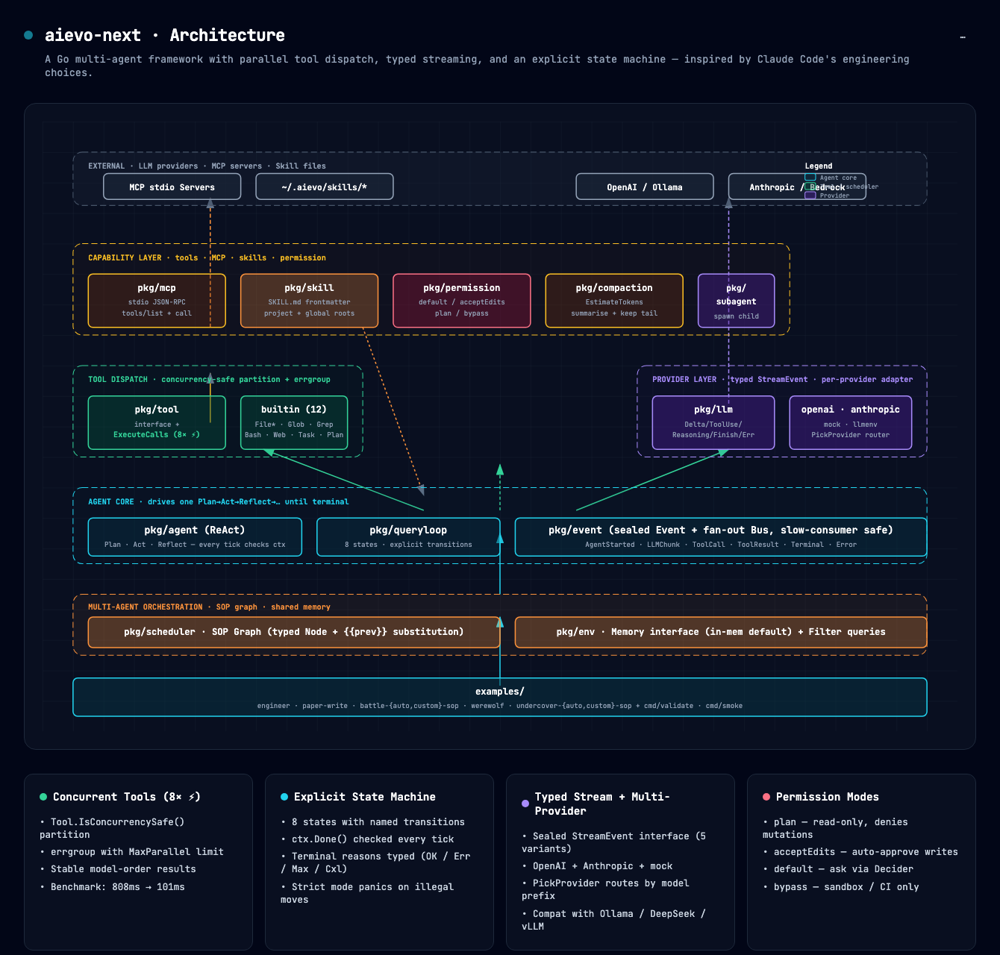

# aievo-next

> A Go multi-agent framework with **parallel tool dispatch**, **typed streaming**, and an **explicit state machine**.
> Re-architected from [aievo](https://github.com/samson-samson/aievo), drawing on Claude Code's engineering choices.

[](https://go.dev/dl/)
[](LICENSE)
[](#verify)
[](#why-it-matters)

---

## What it is

A library for building **single- and multi-agent** LLM applications in Go. The interesting parts are:

- **Concurrent tool dispatch** — when the model calls 8 read-only tools in one turn, they run in parallel (`errgroup`-bounded). Measured 7.95× speed-up over serial.
- **Typed everything** — `Event`, `StreamEvent`, `Error`, `State` are sealed interfaces. The compiler enforces exhaustiveness.
- **Explicit state machine** — `Plan → Act → Reflect → …` with `ctx.Done()` checked every tick. Ctrl-C surfaces in <500ms.
- **Provider-agnostic** — one `LLM` interface; adapters for OpenAI (and any OpenAI-compatible endpoint) and Anthropic ship today.
- **Permission modes** — `default` / `acceptEdits` / `plan` / `bypassPermissions`, the same four shapes Claude Code uses.
- **Extras** — MCP stdio client · `SKILL.md` loader · context compaction · subagent spawning · multi-agent SOP graphs.

---

## Architecture



The 14 packages map cleanly to capabilities. See [`docs/architecture.html`](docs/architecture.html) for the live, interactive version (PNG/PDF export buttons in the corner).

| Layer | Packages |
|---|---|
| Application | `examples/*`, `cmd/{validate,smoke}` |
| Orchestration | `pkg/scheduler` (SOP graph), `pkg/env` (memory + bus) |
| Agent core | `pkg/agent` (ReAct), `pkg/queryloop` (state machine), `pkg/event` |
| Capabilities | `pkg/tool` + 12 builtins, `pkg/mcp`, `pkg/skill`, `pkg/permission`, `pkg/compaction`, `pkg/subagent` |
| Providers | `pkg/llm` + `openai` + `anthropic` + `mock` + `router` |
| Foundation | `pkg/errors` (typed + retry), `pkg/featureflag`, `pkg/llmenv` |

---

## Quickstart

```bash
git clone https://github.com/samson-samson/aievo.git -b aievo-next aievo-next
cd aievo-next
./scripts/quickstart.sh
```

The script checks Go (≥1.23), runs `go mod tidy`, then executes 40 architecture checks **without any API key**. Output ends with `Result: 40 passed  0 failed`.

To run a real example, set credentials and try:

```bash
cp .env.example .env && $EDITOR .env && source .env   # set OPENAI_API_KEY or ANTHROPIC_AUTH_TOKEN
make smoke              # 5-word response from your LLM (proves the wire works)
make example-engineer   # single-agent code generation
```

---

## Hello, world

```go
package main

import (
    "context"
    "fmt"

    "github.com/samson-samson/aievo-next/pkg/agent"
    "github.com/samson-samson/aievo-next/pkg/llmenv"
    "github.com/samson-samson/aievo-next/pkg/tool"
    "github.com/samson-samson/aievo-next/pkg/tool/builtin"
)

func main() {
    llm, _ := llmenv.FromEnv() // picks Anthropic/OpenAI from env

    a := agent.NewReAct(agent.ReActConfig{
        Name:   "engineer",
        LLM:    llm.Client,
        Model:  llm.Model,
        System: agent.StaticSystemPrompt("You are a senior Go engineer."),
        Tools: []tool.Tool{
            builtin.FileRead{},  builtin.FileWrite{}, builtin.FileEdit{},
            builtin.Glob{},      builtin.Grep{},      builtin.Bash{},
        },
    })
    res, _ := a.Run(context.Background(), "Write a TCP echo server in main.go.")
    fmt.Println(res.Final)
}
```

That's the whole API. `Run` drives the state machine until it terminates; concurrent-safe tools run in parallel automatically.

---

## Multi-agent SOP

```go
sched := scheduler.NewMultiAgent(agents, env.New())
g := &scheduler.Graph{
    Start: "research",
    Nodes: map[string]scheduler.Node{
        "research":  {ID: "research",  Agent: "Researcher",  Input: "Topic: {{prev}}", Next: []string{"outline"}},
        "outline":   {ID: "outline",   Agent: "Outliner",    Input: "{{prev}}",         Next: []string{"draft"}},
        "draft":     {ID: "draft",     Agent: "Writer",      Input: "{{prev}}",         Next: []string{"polish"}, OnError: "outline"},
        "polish":    {ID: "polish",    Agent: "Editor",      Input: "{{prev}}"},
    },
}
res, _ := sched.Run(ctx, g, "Why Go suits multi-agent systems")
fmt.Println(res.Final)
```

`Graph` is **data**: validated for cycles before execution, supports `{{prev}}` substitution between nodes, and offers per-node `OnError` fallback paths.

---

## Examples

Seven applications under [`examples/`](examples/), one per typical pattern:

| Folder | Agents | Pattern | Run |
|---|---|---|---|
| `engineer` | 1 | Single ReAct + tools | `make example-engineer` |
| `paper-write` | 5 | Linear research SOP (RTA → LROA → OGA → CGA → PPA) | `make example-paper` |
| `battle-auto-sop` | 6 | Host + 2 debaters + 3 experts (single-pass) | `make example-battle-auto` |
| `battle-custom-sop` | 6 | Same lineup, 2-round explicit SOP | `make example-battle-custom` |
| `werewolf` | 7 | Game master + 6 players, night/day phases | `make example-werewolf` |
| `undercover-auto-sop` | 6 | "Who's the undercover" game | `make example-undercover-auto` |
| `undercover-custom-sop` | 5 | Same game, 2 explicit rounds | `make example-undercover-custom` |

Each ships with a mock-LLM integration test so CI runs without credentials.

---

## Why it matters

The single biggest behavioural improvement over `aievo` is parallel tool dispatch. When the model emits N concurrent-safe tool calls in one turn, they execute in parallel:

```
goos: darwin   arch: arm64   cpu: Apple M4 Pro
BenchmarkAievoNext_ParallelTools-12    5    101538433 ns/op   ≈ 102 ms
BenchmarkAievoNext_SerialTools-12      5    808433117 ns/op   ≈ 808 ms
```

That's a **7.95× speed-up** on 8 calls × 100 ms each — within 0.5% of the theoretical 8× ceiling. Run `make bench` to verify on your hardware.

---

## Verify

Three increasing levels of confidence:

```bash
make test-race      # 23/23 test packages, race detector, no API key needed
make validate       # 40 end-to-end architecture checks, mock LLM, no API key needed
make smoke          # 1 real call to your LLM provider — proves the wire works
```

CI runs the first two on every commit.

---

## Configuration

All runtime knobs go through environment variables — see [`.env.example`](.env.example) for the full list. Selection priority:

1. **`AIEVO_PROVIDER=anthropic|openai`** — explicit override
2. **`ANTHROPIC_AUTH_TOKEN`** or **`ANTHROPIC_API_KEY`** set → Anthropic
3. otherwise → OpenAI

Feature flags follow `AIEVO_FEATURE_<NAME>=1|0`:

| Flag | Default | What it does |
|---|---|---|
| `PARALLEL_TOOLS` | on | Parallel dispatch of concurrency-safe tools |
| `AGENT_RETRY` | on | Retry transient LLM errors (5xx, 429) with backoff |
| `PERSISTENT_MEMORY` | off | Pluggable memory backend (interface defined; backend in v0.2) |
| `SKILL_LOADER` | off | Auto-load `~/.aievo/skills/` into system prompts |
| `STRICT_TRANSITIONS` | off | Panic on illegal state-machine moves (CI/dev) |

---

## Docker

```bash
make docker-build         # produces aievo-next:latest, ~25 MB
make docker-shell         # interactive container with all binaries on $PATH + env passthrough
```

The image exposes `validate`, `smoke`, and every example as commands.

---

## Project layout

```
.
├── cmd/
│   ├── smoke/             # one-prompt LLM smoke check
│   └── validate/          # 40-check architecture validation (no API key)
├── docs/
│   ├── architecture.html  # interactive diagram with PNG/PDF export
│   └── architecture.png   # rendered for README inclusion
├── examples/              # 7 end-to-end demo applications + mock tests
├── pkg/                   # 14 self-contained packages (see Architecture)
├── benchmark/             # tool concurrency benchmark
├── scripts/
│   └── quickstart.sh      # first-run bootstrap
├── .env.example
├── Dockerfile             # minimal alpine runtime, ~25 MB
└── Makefile
```

---

## Contributing

PRs welcome. Before opening one:

```bash
make fmt vet test-race
```

Conventions:

- **No new packages without a docstring** explaining what's in vs. out of scope.
- **No public sealed-interface variants from outside the defining package** — that's the whole point of seals.
- **Every `Tool` declares `IsConcurrencySafe()` truthfully** — false-positive parallel dispatch is the only race the framework can't catch.

---

## License

MIT
